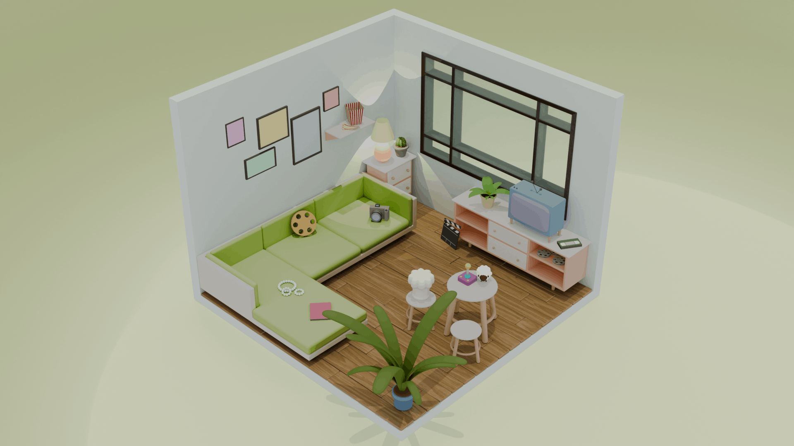

# Meine Webseite mit einem interaktiven 3D-Portfolio

**[Schau es dir an!](https://klarakaden.github.io/KlaraStudio/)**

Dieses Repo beinhaltet den Code für diese Webseite. Zum einen die *'normale'* Webseite mit Rezepten, einer Galerie mit von mir geschossenen Fotos und auch ein Portfolio mit Projekten aus meiner Freizeit und im Studium entstandene. Dieses Portfolio hat jetzt aber einen Twist bekommen, indem man sich das auch anhand von Objekten in einem 3D-Raum anschauen und erkunden kann.



# Setup

Die Webseite wurde mit Nuxt und Vue gebaut. Stelle also sicher, dass Nuxt und pnpm installiert sind, um die Seite lokal laufen zu lassen.

```bash
# pnpm
pnpm install
pnpm run dev
```

# Anmerkungen

Den Raum mit seinen Objekten habe ich selbst in Blender erstellt. Mit etwas Hirnschmalz, etwas Durchhaltevermögen, ein paar (oder doch mehreren) verlorenen Nerven, einigen Youtube-Erklär-Videos und Foren sowie ein klein wenig Unterstütung von KI ist hier nun das (doch sehenswerte) Resultat.

Es ist auch möglich die Seite auf dem Handy anzuschauen.

Ich habe mich dazu entschieden die Webseite mit Nuxt und Vue zu machen, um mein neu erlangtes Wissen aus dem Studium gleich anzuwenden und um die Vorteile einer Komponentenbasierten Webseite auszunutzen.

# Inspiration
- [수아's Room Folio](http://sooahs-room-folio.com/)
